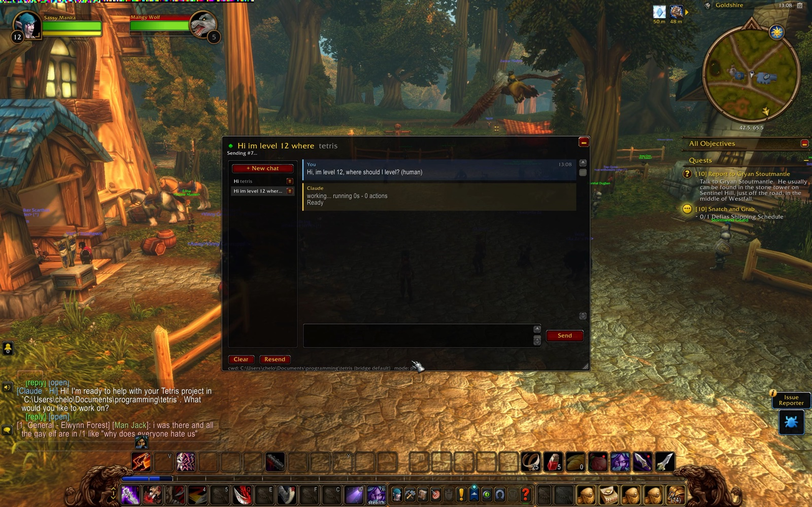

# wow-ai

> **This is the Whisperstone fork.** It is `chelinho139/wow-ai` (MIT) with a **Hermes**
> agent entry added, so the in-game window talks to a Hermes profile instead of
> Claude Code / Codex / Grok. Our additions are the `hermes` adapter, its config,
> docs and tests; the transport, addon and slot/signal machinery are upstream work
> and are credited as such. See `docs/whisperstone/`. Upstream is kept as the
> `upstream` git remote so we can sync and offer the adapter back.
>
> **New here? Read [`docs/whisperstone/PROJECT-NOTES.md`](docs/whisperstone/PROJECT-NOTES.md)
> first** — what we are trying to build, what is actually proven, the current state, and
> the next steps.

<p align="center">
  
</p>

Chat with your local coding agents from inside **World of Warcraft: Forever**: [Claude Code](https://claude.com/claude-code), [OpenAI Codex](https://developers.openai.com/codex) and [xAI's Grok Build](https://docs.x.ai/build/overview). Send a task, go back to questing, get pinged in-game when the answer lands. No alt-tabbing, no `/reload` per message.

- Multiple chats, each its own persistent agent session (like separate terminals), running in parallel. Each chat picks its agent and its folder
- Live progress while the agent works: action count, elapsed time, the files it's editing and commands it's running
- Replies echoed into the game chat; `/r` replies to the agent when it was the last to message you
- The agent knows your character, level, zone, talents and professions (optional), and you can shift-click items, spells and quests into a message
- An **Allow & retry** button when Claude or Grok needs a command outside your allowlist
- A status light for the bridge, automatic retries, and recovery of your chats if the beta client wipes addon data

Nothing here injects code, reads game memory, or generates input. The addon uses documented addon APIs only; the companion reads your screen and writes ordinary files.

## How it works, in one paragraph

WoW addons are sandboxed: no network, no file reads at runtime. Two doors remain. **Out:** the addon draws your message as a strip of colored 4-pixel squares in the top-left corner of the screen; the bridge screen-captures that corner four times a second, decodes it, and runs the chat's agent headless in the chat's folder. **In:** a load-on-demand addon reads its files from disk at the moment it is loaded, so the bridge writes the reply into a pool of 200 pre-made slot addons and the game loads a fresh one from a timer. Cheap "is it ready yet" checks ride on a third trick: an empty `.wav` won't play and a valid one will. Details in [docs/ARCHITECTURE.md](docs/ARCHITECTURE.md).

## Agents

The bridge drives whichever of these you have installed; each chat can use a different one.

| Agent | CLI the bridge runs | Permissions | Allow & retry |
|---|---|---|---|
| **Claude Code** (`claude`) | `claude -p --output-format stream-json`, resumed with `--resume` | `permissionMode` + `allowedTools` rules | yes |
| **Codex** (`codex`) | `codex exec --json`, resumed with `codex exec resume` | a sandbox chosen from `permissionMode` (read-only, workspace-write, or none) | no: a command the sandbox declined is reported in the reply |
| **Grok Build** (`grok`) | `grok --prompt-file … --output-format streaming-json`, resumed with `-r` | `permissionMode` + the same `allowedTools` rules, translated to Grok's globs | yes, when Grok reports a refused tool |
| **Ara** (`hermes`) | `hermes chat --query-file - --format stream-json -Q`, resumed with `--resume` | Hermes manages permission internally; `maxTurns` bounds the run | no: no per-tool allowlist to retry against |

`agent` in `bridge/config.json` is the default (shipped here as `hermes` — Whisperstone-local; upstream keeps `claude`). `/wow-ai agent codex` switches the current chat, or right-click a chat in the left panel and pick **Agent...**; the reply bubbles and the game-chat echo are labelled with whoever answered. A session belongs to the agent that made it, so a chat that changes agent starts a fresh session there (its transcript stays). Install notes, the exact command lines, what each permission mode means per agent, and known limits are in [docs/AGENTS.md](docs/AGENTS.md).

## Requirements

- Windows, NTFS
- World of Warcraft: Forever (tested on 1.60.1.69913, TOC 16001), **windowed or borderless** — exclusive fullscreen blocks screen capture
- [Node.js](https://nodejs.org) 22.2 or newer
- At least one agent CLI, installed and logged in:
  - [Claude Code](https://claude.com/claude-code): `claude --version` works
  - [Codex](https://developers.openai.com/codex): `npm install -g @openai/codex`, then `codex` once to log in
  - [Grok Build](https://docs.x.ai/build/overview): `irm https://x.ai/cli/install.ps1 | iex`, then `grok login`

## Install

Step-by-step for a fresh machine, with troubleshooting: [docs/INSTALL-WINDOWS.md](docs/INSTALL-WINDOWS.md). The short version:

```powershell
git clone https://github.com/chelinho139/wow-ai
cd wow-ai
node setup.js --project "C:\path\to\the\project\you\want\to\work\on"
```

`setup.js` finds the client (pass `--wow "<client folder>"` if it can't), copies the addon into `Interface\AddOns\WoWAI`, writes `bridge/config.json`, reports which agent CLIs it found, and generates the slot pool and signal files (≈15,000 tiny files; that's normal — the client only discovers addon files at launch, so they have to exist up front).

Then **fully quit and relaunch WoW**, enable *WoW AI* on the AddOns screen, and start the bridge:

```
npm start               # in the current terminal (or: bridge\start.ps1)
bridge\start-window.cmd # double-click version: opens its own window
```

It restarts itself if it ever crashes. Ctrl+C (or closing the window) stops it. The banner lists every agent with where its executable was found, or what to install.

### Upgrading from wow-claude

This project used to be called wow-claude, with a `WoWClaude` addon and a `/wow-claude` command. `git pull` (or clone the new name) and run `node setup.js` again: it copies your chats and settings from the old addon's saved data, removes the old `WoWClaude` addon and its slot folders so the two don't fight over `/ai` and `/r`, and rewrites the paths and the Claude settings in `bridge/config.json` into the new layout. Then quit and relaunch WoW. If you had installed the command, run `npm unlink -g wow-claude` and `npm link` again, and re-do `/wow-ai bind <key>` if you had a hotkey. Your agent sessions carry on: the bridge keeps them per chat.

### `wow-ai`: start it from the project folder

Like the agent CLIs themselves, the bridge works in the folder you start it from. Install the command once:

```powershell
npm link          # in the wow-ai folder; makes `wow-ai` available everywhere
```

Then, from any project:

```powershell
cd C:\path\to\realms
wow-ai
```

Every chat that hasn't picked its own folder now works in `realms`, and the panel's cwd line shows it. `wow-ai --project <dir>` names the folder explicitly; `npm start` inside this repo falls back to `defaultCwd` in the config. Only one bridge can run at a time (two would fight over the screen and the slot files), so this sets the default folder rather than giving you one bridge per project.

## Use

In game: `/wow-ai` opens the window. Until the bridge has answered, a **Connect** button sits where Send would be: start the bridge, click it, and the light turns green (a message typed before that stays in the box). Then click the input box, type, Enter. The reply arrives with the whisper sound; the window's light shows the bridge state (green/yellow/red, hover for details), and **Reconnect** shows up if the bridge goes quiet.

Right-clicking a chat in the left panel opens a small menu with **Rename...**, **Folder...** and **Agent...** (right-click again to close it); the trash can on the row deletes the chat after an OK/Cancel confirm. **Folder...** sets the folder this chat's agent works in (same as `/wow-ai cd` below), **Agent...** which agent answers it (same as `/wow-ai agent`); each chat keeps its own, so you can have chats on different projects, with different agents, side by side.

| Command | What it does |
|---|---|
| `/wow-ai` | toggle the window (`/ai`, `/wowai` and the old `/wow-claude` are the same command); the minimize button (top right) or Esc collapses it to a small bar, click the bar to expand |
| `/ai <text>` | send from the normal chat box (`/wow-ai <text>` is the same). `/ai` is a full alias, so `/ai agent grok` or `/ai cd realms` work too; a message that merely starts with a command word, like `/ai help me with this macro` or `/ai delete the unused imports`, is still sent as a message because the rest of the line doesn't fit that command |
| `/r <text>` | replies to the agent when it was the last to message you; otherwise the normal whisper reply |
| `/wow-ai new [name]` | new chat = new agent session. Unnamed chats take their title from your first message |
| `/wow-ai chat <n\|name>` | switch chats (or click the left panel; right-click a row for Rename, Folder and Agent, its trash can deletes it) |
| `/wow-ai agent [claude\|codex\|grok\|hermes]` | which agent this chat talks to; no name shows the current one and the bridge's default, `default` goes back to the bridge's. A chat that changes agent starts a fresh session with it |
| `/wow-ai cd <folder>` | folder this chat's agent works in (**Folder...** after right-clicking the chat opens the same thing as a dialog). Relative to the bridge's folder (`/wow-ai cd realms`, `/wow-ai cd ../other`), `~` works, a full path too; `/wow-ai cd` alone goes back to the bridge's default. A chat that changes folder starts a fresh session there |
| `/wow-ai reset` | wipe this chat's agent memory, keep the transcript |
| `/wow-ai context [on\|off]` | show what the agent is told about your character and location, or turn it on/off |
| `/wow-ai rename`, `/wow-ai delete`, `/wow-ai clear` | manage the current chat |
| `/wow-ai echo full\|short\|off\|<chars>` | how much of each reply to print into the game chat (default 4000 chars) |
| `/wow-ai longchat on` | let the game chat box take 4000 characters, for long `/ai` messages |
| `/wow-ai bind <key>` | hotkey: checks for a reply while waiting, otherwise toggles the window |
| `/wow-ai cancel` | stop waiting on this chat's reply |
| `/wow-ai resend` | show the strip again if the bridge missed it |
| `/wow-ai reload` | reload the UI now (also frees the slot pool) |
| `/wow-ai mode reload` | fallback transport that costs a `/reload` per step, if pixels or slots can't work |
| `/wow-ai diag`, `/wow-ai slots` | transport diagnostics |
| `/wow-ai help` | the full list |

Click any message, or `/wow-ai copy` for the last reply, to open it in a selectable box for Ctrl+C.

### The agent knows where you are

The addon tells the agent which game and client you are on, your character (name, realm, level, race, class, faction, guild), where you are (zone, subzone and the map coordinates the minimap shows), your money, talents and professions. A few lines, sent with the addon's hello and again whenever they change, and put into the agent's system prompt by the bridge (Claude and Grok take a system prompt; for Codex the bridge puts it at the top of the message, marked as context), so you can ask "what should I be doing at my level around here?" or "write me a macro for my class" without explaining yourself first. It is only a hint: for a chat about an unrelated project it changes nothing. `/wow-ai context` shows exactly what is sent; `/wow-ai context off` stops sending it (the bridge forgets it too), and `"gameContext": false` in `bridge/config.json` turns it off for good.

Along with it, every run gets [docs/WOW-ADDON-PRIMER.md](docs/WOW-ADDON-PRIMER.md): a short reference on writing addons and macros for this client (TOC layout, sandbox rules, common frames and events, where to verify an API), so "write me an addon that..." works from any folder, not just this repo. Edit the file to suit your setup; the bridge re-reads it on every run. `"primerFile": ""` in the config drops it, and `/wow-ai context off` turns it off together with the character context.

### Link items, spells and quests

Click the input box, then **shift-click** an item in your bags, a spell in the spellbook, a quest in the log, or a link in the chat: it lands in your message the way it would in the game chat. When you send, each link becomes `[Name]` in the text and its tooltip (an item's stats, a spell's description) is attached below, so the agent sees what you see when hovering it. This works from the game chat box too (`/ai is this an upgrade? [Fine Longsword]`). Without a box focused, shift-click keeps its normal meaning.

### Permissions

The agents run headless, so they can't ask you to approve a tool. Each agent's block in `bridge/config.json` has a `permissionMode`, `acceptEdits` by default: file edits inside the project are auto-approved, `allowedTools` lists the commands it may run (`Bash(git:*)` is any command starting with `git`; the same rule syntax for every agent, translated for Grok), and `deniedTools` the ones it never may. What happens to anything else differs. Claude denies it. Codex has no allowlist: it runs commands in a sandbox that can write the project folder but not reach the network (unless `networkAccess` is on), and explains a blocked command in its reply. Grok's headless mode runs ordinary commands on its own and blocks the dangerous ones (deleting a project file, pushing) unless a rule allows them. With Claude and Grok the reply then grows an **Allow WebSearch, Bash(cargo:*) & retry** button: click it, the rules are added to that agent's list in your config permanently, and the agent resumes where it stopped. The rule is a prefix (`Bash(rm:*)` allows any `rm`), so read the button before clicking. `bypassPermissions` gives any agent full autonomy; you decide. The mapping per agent, as measured against the real CLIs, is in [docs/AGENTS.md](docs/AGENTS.md).

## Configuration (`bridge/config.json`)

The keys you are most likely to touch. Every key, flag and environment variable is in [docs/CONFIGURATION.md](docs/CONFIGURATION.md).

| Key | Meaning |
|---|---|
| `defaultCwd` | folder for chats that haven't been given one with `/wow-ai cd` |
| `agent` | the agent for chats that haven't picked one with `/wow-ai agent` (shipped as `hermes` here — Whisperstone-local; upstream ships `claude`; the allowed names are `claude`, `codex`, `grok` or `hermes`) |
| `agents.<id>.permissionMode`, `.allowedTools`, `.deniedTools`, `.model` | that agent's permissions, allowlist, denylist and model; `.path` where its executable is if the bridge can't find it, `.extraArgs` anything else to pass it |
| `agents.codex.networkAccess` | let Codex's sandbox reach the network (default `false`) |
| `maxParallel` | how many chats may run an agent at once (default 3) |
| `gameContext` | `false` never tells the agent about your character, whatever the addon sends (default `true`) |
| `primerFile` | the addon/macro primer appended with the context (default `docs/WOW-ADDON-PRIMER.md`; `""` = none) |
| `capture.processName` | the game exe without `.exe` (`WowB` for Forever); set by `setup.js` |
| `slots`, `actMax`, `presenceMax` | pool sizes; must match the constants at the top of `WoWAI.lua` if you change them |
| `timeoutMs` | kill a run that takes longer than this (default 30 min) |

## Troubleshooting

- **Connect says "No answer from the bridge" / light stays red** — is the bridge running? Is the game window on screen and not minimized? Exclusive fullscreen blocks capture. `bridge.log` shows `strip #N` when a message is decoded and `strip seen but rejected: ...` when one is misread.
- **The reply says "X is not installed on the bridge PC"** — the bridge's banner shows where it looked for each agent. Install the CLI, or put the full path of its executable in `agents.<id>.path` in `bridge/config.json` and restart the bridge.
- **A reply says the agent is not logged in, or asks for a login** — run the CLI once by hand on the bridge PC (`claude`, `codex`, `grok login`, or `hermes chat`) and log in; the bridge reuses that.
- **Reply never appears but `bridge.log` says `done`** — `/wow-ai slots`; if the pool is empty, `/wow-ai reload` frees it and picks the reply up via the fallback path.
- **"Reply slots not installed"** — `node bridge/install-slots.js`, then restart WoW.
- **Chats vanished after a reload** — the beta client sometimes wipes addon saved data. The bridge keeps `transcripts.json` and sends your chats back automatically on the next message.
- **`/wow-ai diag` says the sound channel is unusable** — the cheap readiness checks and heartbeat are off; everything still works through slot polls, just with coarser progress. If it says a valid file reports as unplayable, WoW hasn't been restarted since the files were created.

## Documentation

- [docs/INSTALL-WINDOWS.md](docs/INSTALL-WINDOWS.md): step-by-step install on a fresh machine, with troubleshooting
- [docs/AGENTS.md](docs/AGENTS.md): each agent's install, how the bridge drives it, permissions per agent, limits, and how to add another
- [docs/CONFIGURATION.md](docs/CONFIGURATION.md): every config key, command-line flag and environment variable
- [docs/ARCHITECTURE.md](docs/ARCHITECTURE.md): how the pixel strip, slot pool and signal files work, and why
- [CONTRIBUTING.md](CONTRIBUTING.md): repo layout, running the tests, conventions
- [CHANGELOG.md](CHANGELOG.md): release notes

## Development

```
npm install
npm test          # everything except the live test; CI runs it on Windows (.github/workflows/test.yml)
npm run test:live # runs the bridge in a sandbox with a real agent call (add -- --agent codex, grok or hermes)
```

Layout: `addon/WoWAI` is the addon, `bridge/` the companion (`bridge.js` does I/O and processes, `protocol.js` is the pure part, `agents.js` knows how to launch and read each agent), `docs/` the design and reference, `tests/` the checks. After editing the addon, copy it into the game folder (`node setup.js` does that too) and `/reload`. What each test covers, and the conventions for changes, are in [CONTRIBUTING.md](CONTRIBUTING.md).

## Credits

- [0xInuarashi's wow-forever-codex](https://github.com/0xinuarashi/wow-forever-codex) measured the client's file-loading rules on a live Forever build (files must exist at launch; a not-yet-loaded file is read fresh on first use) and pioneered the pixel-out channel for Codex, with a font-metrics return channel. This project uses the same rules with load-on-demand addons instead of fonts.
- [Gethe/wow-ui-source](https://github.com/Gethe/wow-ui-source) — Blizzard's UI code, `forever` branch, used to verify every API this addon calls.

## License

MIT — see [LICENSE](LICENSE).
